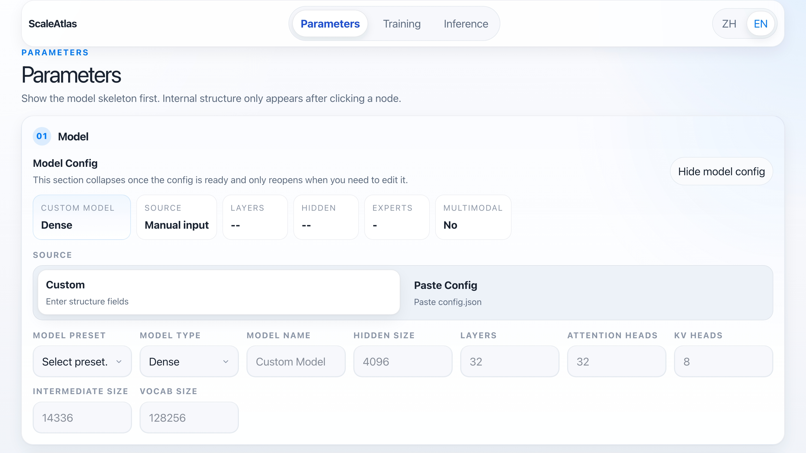

# ScaleAtlas

ScaleAtlas is an open-source planning tool for LLM parameters, training VRAM, and inference capacity.

It is designed for teams that need a fast, explainable answer to questions such as:

- How many parameters does this model actually have?
- Will it fit on the target GPUs for training?
- Which TP / PP / DP / EP layouts are valid?
- How much memory and concurrency are needed for inference?

Language:

- English: this file
- 中文: [README.zh-CN.md](./README.zh-CN.md)



## Why ScaleAtlas

Most sizing workflows sit at one of two extremes:

- rough spreadsheets with little architecture awareness
- framework-internal calculators that are hard to explain and review

ScaleAtlas aims for the middle ground:

- simple enough for planning and communication
- detailed enough to explain the result
- visual enough to review with engineers and non-specialists together

## What It Covers

ScaleAtlas ships with three focused workflows:

- `Parameters`
  Inspect model structure, module-level parameter counts, and memory by precision.
- `Training`
  Estimate peak memory, throughput, and feasible parallel strategy.
- `Inference`
  Estimate deployment memory, safe concurrency, and serving parallelism.

## Highlights

- Architecture-aware parameter breakdown
- Dense, MoE, and multimodal model support
- HuggingFace `config.json` import
- Bilingual `ZH / EN` UI

## Quick Start

Requirements:

- Node.js 20+
- npm

Install dependencies:

```bash
npm install
```

Start the local app:

```bash
npm run dev
```

Build for production:

```bash
npm run build
```

## Testing

Run logic and unit tests:

```bash
npm test
```

Run browser screenshot regression:

```bash
npm run test:e2e
```

Update screenshot baselines:

```bash
npm run test:e2e:update
```

## Repository Layout

```text
src/
  content/               Copy dictionaries and copy types
  engine/                Core sizing and planning logic
  features/parameter/    Parameter-page model and rendering
  components/            Shared UI and planner pages
  styles/                tokens / layout / planner / parameter styles
  stores/                Zustand state
  parsers/               HuggingFace config parsing
tests/                   Logic and structure tests
e2e/                     Playwright visual regression tests
```

## Notes

- `config.toml` is treated as a local machine-specific file and is ignored by git.
- `dist/`, `test-results/`, and Playwright reports are generated artifacts and are ignored by git.
- The repository maintains screenshot baselines for:
  - parameter page expanded state
  - training result state
  - inference result state
  - `ZH / EN`
  - selected responsive breakpoints

## Suggested GitHub Metadata

- Repository name: `Scaleatlas`
- Description:
  `Open-source planner for LLM parameters, training VRAM, and inference capacity.`
- Suggested topics:
  `llm`, `gpu`, `vram`, `inference`, `training`, `moe`, `huggingface`, `resource-planning`, `capacity-planning`, `playwright`

## Roadmap

- More architecture-aware presets
- Broader multimodal breakdown coverage
- CI-backed visual regression
- Better result export and comparison workflows

## License

MIT
